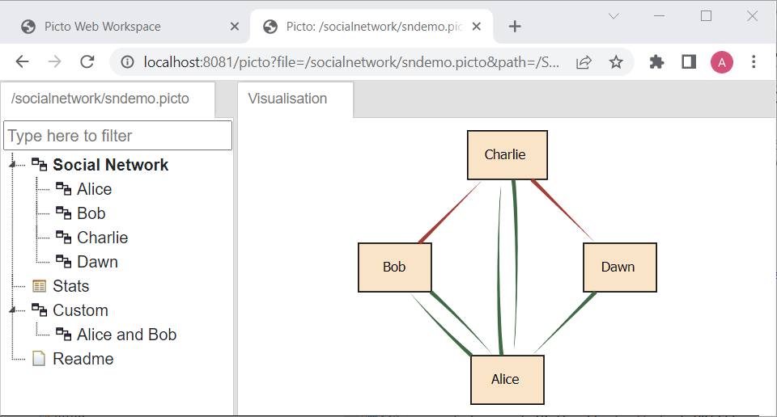
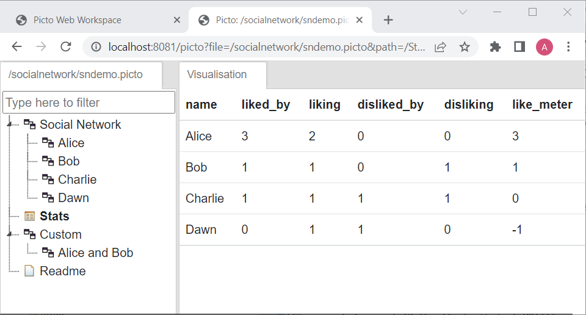
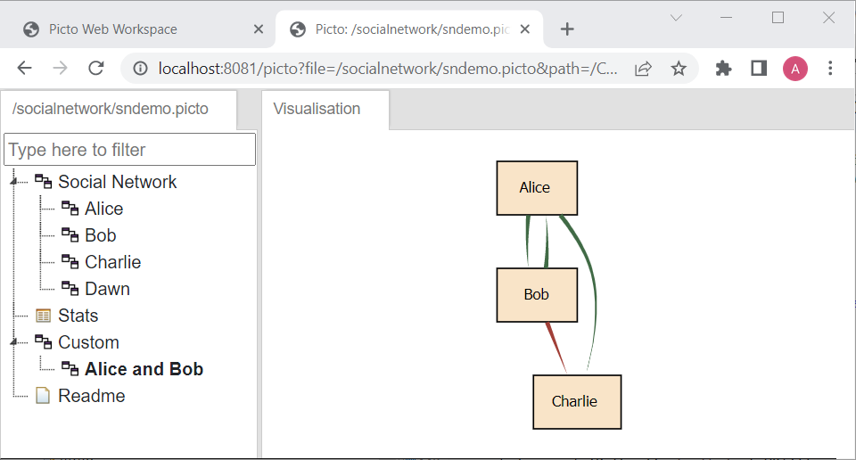
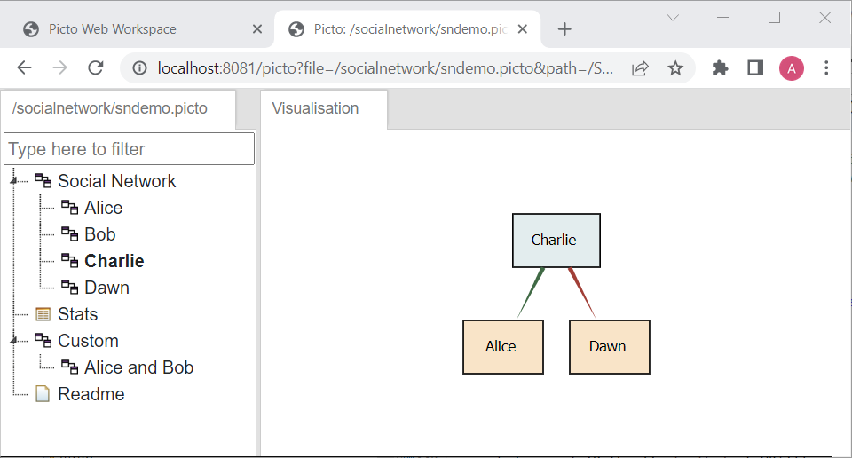

# [Picto Web](#contents)

## [Contents](#contents)
- [Picto Web](#picto-web)
  - [Contents](#contents)
  - [Introduction](#introduction)
  - [Docker](#docker)
  - [Demo](#demo)
    - [Automatic Client Update](#automatic-client-update)
    - [Different Views](#different-views)
    - [Another Example](#another-example)

## [Introduction](#contents)
[Picto Web](https://github.com/epsilonlabs/picto-web) is a tool for complex model exploration. With it, users can visualise large models in different views and formats and also perform drill down/up navigation throughout the models' elements. Picto Web is the web version of the [Picto](https://www.eclipse.org/epsilon/doc/picto/) for Eclipse. It aims to support all features that the plugin is capable of, except that it is a web application, which allows multiple remote users to explore the same model concurrently. 

The app can read *.picto files and display the view trees and views of the files. It can also monitor files in a directory if they have changed and send the updates to the front-end for auto-refresh. Picto Web also refactors [Picto](https://www.eclipse.org/epsilon/doc/picto/) so that its core libraries are independent of the Eclipse platform. The app is packaged in a [Docker container](https://hub.docker.com/r/alfayohannisyorkacuk/picto-web).

## [Docker](#contents)
The docker image of Picto Web can be temporarily found here: [https://hub.docker.com/r/alfayohannisyorkacuk/picto-web](https://hub.docker.com/r/alfayohannisyorkacuk/picto-web). Execute the following command to pull it from https://hub.docker.com:
```
docker pull alfayohannisyorkacuk/picto-web
```

## [Demo](#contents)
Clone Picto Web project from GitHub using the command below 
```
git clone https://github.com/epsilonlabs/picto-web
```
For MODELS 2022 tooldemo. It's recommended to use the `tooldemo` branch.
```
git checkout -b tooldemo
```
Change directory to sub-directory `workspace`.
```
cd picto-web/workspace
```
If your operating system is Windows, run the command below to run the Picto Web server. The variable `%cd%` represents your current working directory in Windows. 
```
docker run --rm -i -t -v %cd%:/workspace --hostname=picto -p 8080:8080 --name=picto alfayohannisyorkacuk/picto-web
```
Replace `%cd%` with `$PWD` if Linux is your current operating system, 
```
docker run --rm -i -t -v $PWD:/workspace --hostname=picto -p 8080:8080 --name=picto alfayohannisyorkacuk/picto-web
```
Or replace it with any directory path if you want to set the directory as the working directory of Picto Web. The command maps the local host directory to the internal `workspace` directory in the Docker container. Therefore, the Picto Web app in the Docker container can access the local host directory. The commands will display output like the following.


Browse http://localhost:8080 to load the Picto Web app. It will display the `main` page that shows *.picto files in the mapped directory.


### [Automatic Client Update](#contents)

Click the `the socialnetwork.model.picto` link. It will open another tab that shows the view tree of Picto Web and then click the `Social Network` node to display the page below.



Go back to the `main` page and click again the `the socialnetwork.model.picto` link. It will open the same tab as before. Now, click the node `Stats` on the tree. It will display the following table.



After that, open any text editor. Open the `socialnetwork.model` file and then change the value of Alice's `name` attribute from `Alice` to `Amber`. Picto Web automatically sends the change to the clients to update `Alice` to `Amber`.

**IMPORTANT! If you use the Docker container, this automatic client update only works on Linux OS. Since the Docker container uses Linux as the OS, it can only detect changes in files on the same OS; changes cannot be detected on Windows. However, if Picto Web runs directly from its source code (not using Docker container) on Windows, changes on files can be detected perfectly as well.**

### [Different Views](#contents)

Picto Web also supports displaying custom views and drilling down views of a model. The custom view is displayed in the following image, which only shows the network of `Alice` and `Bob`.



Also, explore the view tree by clicking any of the nodes. For example, the below figure shows the view of the `Charlie` node.



### [Another Example](#contents)
Besides the `social network` example, Picto Web also has been able to visualise `Ecore` metamodel in the documentation-like format in HTML.


