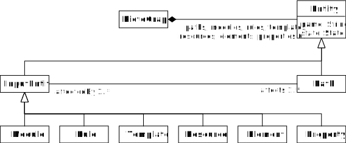

# AccessGraphResource




```java
@namespace(uri="pictograph", prefix="")
package pictograph;

mapentry EntityMap : String -> Entity;

enum State {
	NEW;
	PROCESSED;
}

class PictoGraph {
    val EntityMap[*] paths;
    val EntityMap[*] modules;
    val EntityMap[*] rules;
    val EntityMap[*] templates;
    val EntityMap[*] resources;
    val EntityMap[*] elements;
    val EntityMap[*] properties;
}

abstract class Entity {
    attr String name;
    attr State state;
}

abstract class InputEntity extends Entity {
    ref Path[*]#affectedBy affects;
}

class Path extends Entity {
    ref InputEntity[*]#affects affectedBy;
}

class Module extends InputEntity {
    val Rule[*]#module rules;
}

class Resource extends InputEntity {
     val Element[*]#resource elements; 
}

class Property extends InputEntity {
    ref Element#properties element;
    attr String previousValue;
    attr String value; 
}

class Element extends InputEntity {
    ref Resource#elements resource; 
    val Property[*]#element properties;
}

class Rule extends InputEntity {
    ref Module#rules module;
    ref Template template;
    ref Element[*] contextElements;
    ref Element[*] elements;
}

class Template extends InputEntity {
    ref Module[*] modules;
    ref Rule[*] rules;
    ref Element[*] elements;
}
```
## More
* [Architecture](architecture.md)
