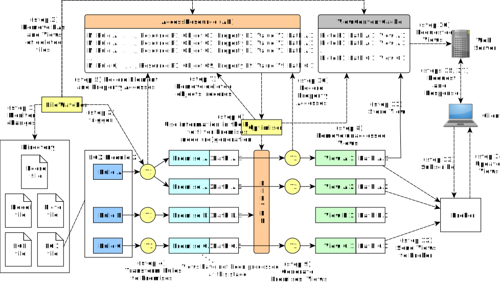

# Architecture




```java
/* Logics in the filter -- Checking if a view/path needs (re)generation: new, needs update, or deletion */

function boolean isViewNewOrUpdated(String checkedPath, EgxModule currentModule) {

  // new path
  if path is not in the property accesses (PA) {
    return true;
  }

  // new object (possibly covered in the 'new path' above, but it's not always)
  if ... ??? ...  {
    return true;
  }

  // deleted object
  if the object associated with the path in the PA does not exists, null value {
    return true;
  }

  // modified property
  if the current value of a property associated with the path is not equal to its respective value recorded in the PA {
    return true;
  }
  ...
}

```