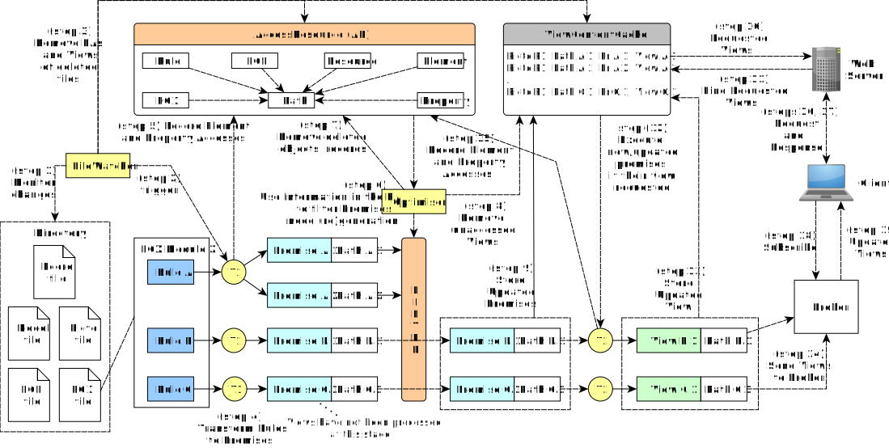

# Architecture



```java
/* Logics in the filter -- Checking if a view/path needs (re)generation: new, needs update, or deletion */

function boolean isViewNewOrUpdated(String checkedPath, EgxModule currentModule) {

  /* new path */
  if path is not in the property accesses (PA) {
    return true;
  }

  /* new object */
  //1. As long as the addition of a new object changes the state of, at least, another object's property that has been accessed previously, adding a new object is handled in the 'modified property' condition below.
  

  /* deleted object */
  if the object associated with the path in the PA does not exists, null value {
    return true;
  }

  /* modified property */
  if the current value of a property associated with the path is not equal to its respective value recorded in the PA {
    return true;
  }
  ...
}

```